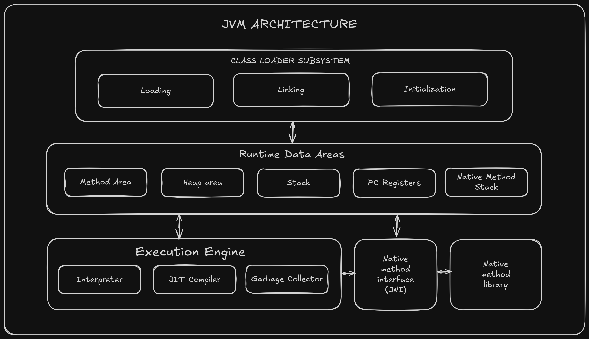

# JVM Architecture Report


## 2. JVM Components Explained

### Class Loader
The Class Loader loads .class files into memory. It has three phases:
- **Loading**: Reads .class file and loads bytecode
- **Linking**: Verifies and prepares the class
- **Initialization**: Executes static blocks and variables

### Runtime Data Areas
These are memory areas used during program execution:
- **Method Area**: Stores class structures, method code, and static variables
- **Heap**: Stores all objects and instance variables
- **Stack**: Stores local variables and method calls (one stack per thread)
- **PC Registers**: Keeps track of current instruction being executed
- **Native Method Stack**: For native (non-Java) methods

### Execution Engine
Executes the bytecode using:
- **Interpreter**: Reads and executes bytecode line by line
- **JIT Compiler**: Converts frequently used bytecode to native machine code
- **Garbage Collector**: Removes unused objects from heap memory

## 3. JIT Compiler vs Interpreter

### Interpreter
- Executes bytecode **line by line**
- **Slower** execution because it translates each instruction every time
- No compilation overhead
- Good for code that runs only once

### JIT (Just-In-Time) Compiler
- Compiles bytecode to **native machine code** at runtime
- Stores compiled code for reuse
- **Faster** execution for frequently used code
- Takes time to compile initially but speeds up repeated execution
- Optimizes code based on runtime behavior

**Example**: If a loop runs 1000 times, the interpreter translates it 1000 times, but JIT compiles it once and reuses the native code.

## 4. Bytecode Execution Process

1. **Write Java Code**: Developer writes `Program.java`
2. **Compilation**: Java compiler (`javac`) converts it to `Program.class` (bytecode)
3. **Class Loading**: Class Loader loads the bytecode into JVM
4. **Verification**: JVM verifies the bytecode for security and correctness
5. **Interpretation**: Execution Engine interprets bytecode
6. **JIT Compilation**: Hot code (frequently executed) is compiled to native code
7. **Execution**: Native code runs directly on the system's processor
8. **Garbage Collection**: Unused objects are removed from memory

## 5. "Write Once, Run Anywhere" Principle

**What it means**: Java code compiled on one platform can run on any other platform without modification.

**How it works**:
- Java source code is compiled to **bytecode** (not machine code)
- Bytecode is platform-independent
- Each operating system has its own JVM implementation
- The JVM translates bytecode to the specific machine code for that platform
- Same `.class` file works on Windows, Mac, Linux, etc.

**Example**:
```
Write on Windows → Compile to bytecode → Run on:
                                         • Windows JVM
                                         • Linux JVM
                                         • Mac JVM
                                         • Any JVM
```

This is possible because bytecode is standardized and JVM handles the platform-specific details.
