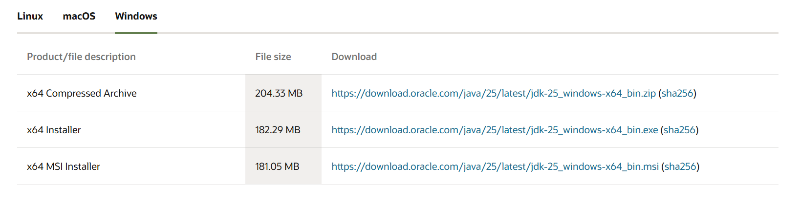
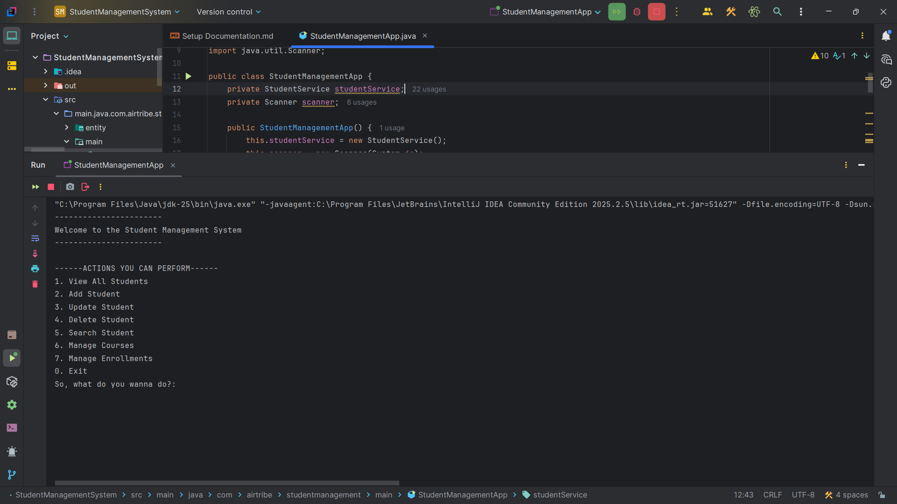

# Environment Setup & JDK Configuration Guide

## Table of Contents

1. Download JDK
2. Environment Variables Configuration
3. Screenshot of successful Java compilation and execution

## JDK Installation

### Step 1: Download JDK

1. Visit Oracle's official website: https://www.oracle.com/java/technologies/downloads/
2. Download JDK 8 or higher.
3. Choose the appropriate version for your operating system:

### Step 2: Environment Variables Configuration
1. Right-click on "This PC" or "My Computer"
2. Select "Properties"
3. Click "Advanced system settings"
4. Click "Environment Variables" button
5. Under "System variables", click "New"
6. Add the following variables:

**JAVA_HOME:**

- Variable name: `JAVA_HOME`
- Variable value: `C:\Program Files\Java\jdk-25` (your JDK installation path)

### Step 3: Screenshot of successful Java compilation and execution
